# TAK Rig Screenshots

A selection of TAK Rig interface screenshots. Click any thumbnail to open the full-resolution image.

<table>
  <tr>
    <td align="center" width="50%">
      <a href="https://raw.githubusercontent.com/5lyf0x/TAK-Rig/main/screenshots/ADSB.png">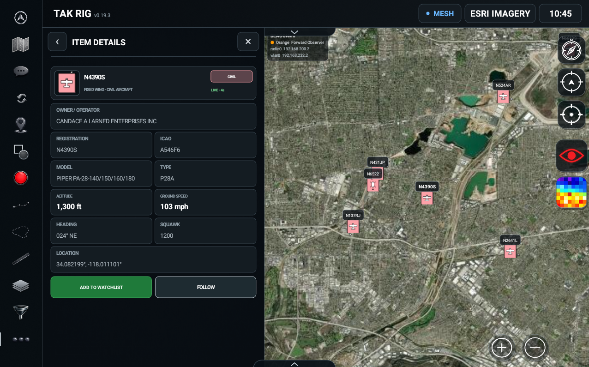</a> 
      <b>ADS-B Aircraft Tracking</b>
    </td>
    <td align="center" width="50%">
      <a href="https://raw.githubusercontent.com/5lyf0x/TAK-Rig/main/screenshots/ROUTE.png">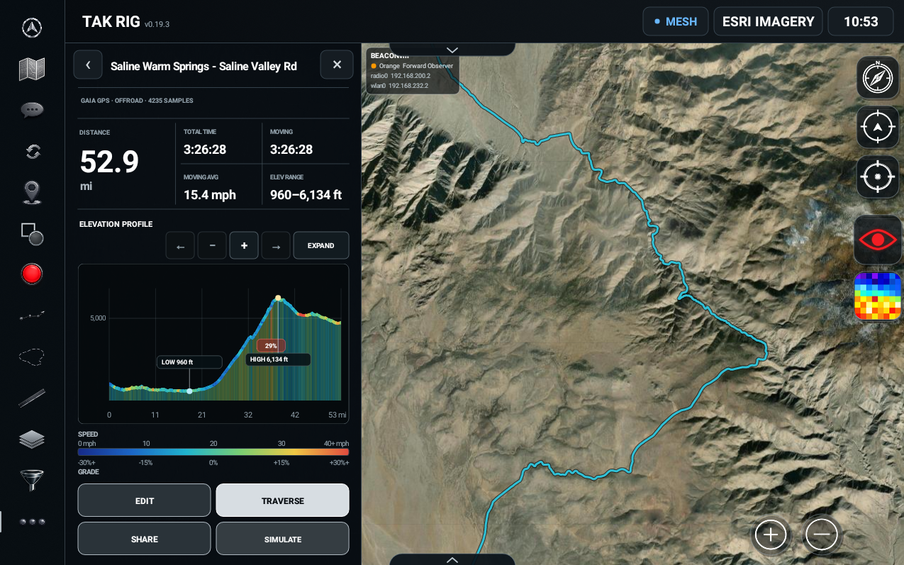</a> 
      <b>Route Details &amp; Elevation Profile</b>
    </td>
  </tr>
  <tr>
    <td align="center" width="50%">
      <a href="https://raw.githubusercontent.com/5lyf0x/TAK-Rig/main/screenshots/BASEMAPS.png">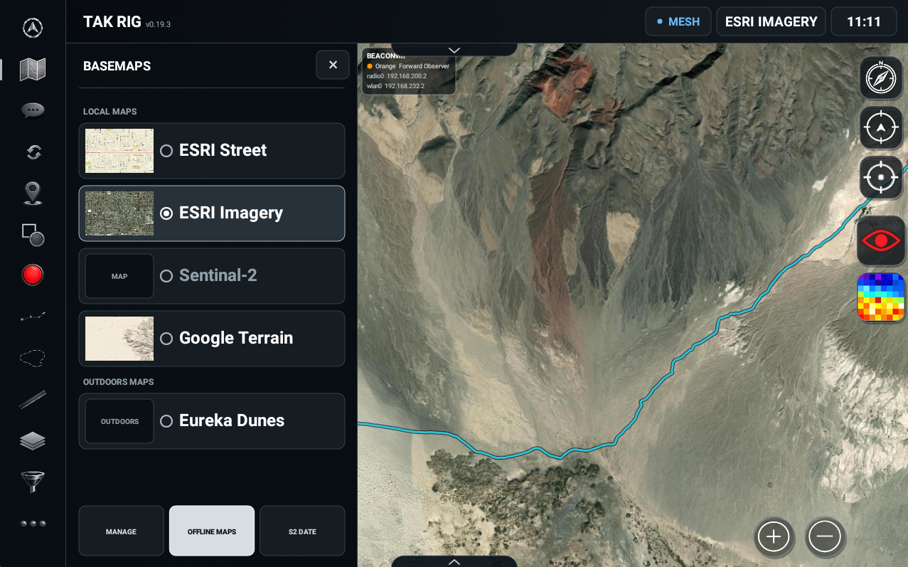</a> 
      <b>Basemap Selection</b>
    </td>
    <td align="center" width="50%">
      <a href="https://raw.githubusercontent.com/5lyf0x/TAK-Rig/main/screenshots/OFFLINEMAP_1.png">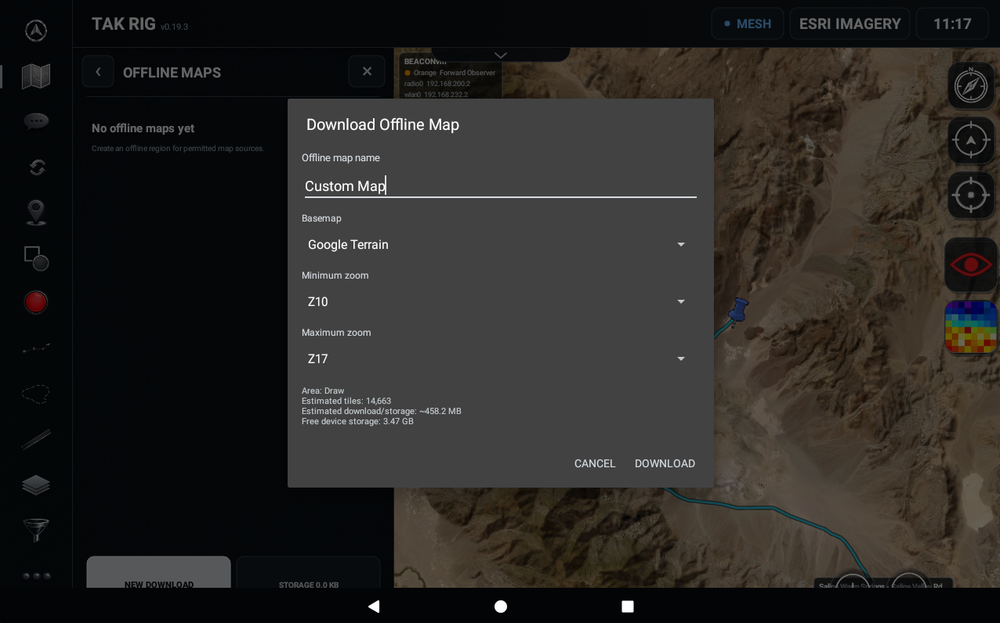</a> 
      <b>Offline Map Download Setup</b>
    </td>
  </tr>
  <tr>
    <td align="center" width="50%">
      <a href="https://raw.githubusercontent.com/5lyf0x/TAK-Rig/main/screenshots/OFFLINEMAP_2.png">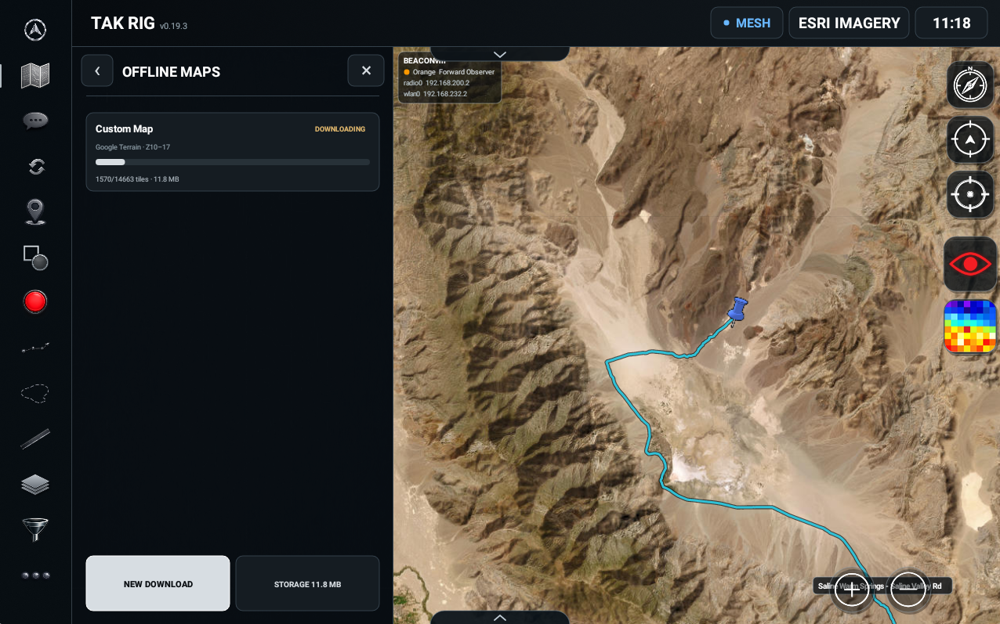</a> 
      <b>Offline Map Download Progress</b>
    </td>
    <td align="center" width="50%">
      <a href="https://raw.githubusercontent.com/5lyf0x/TAK-Rig/main/screenshots/CHAT.png">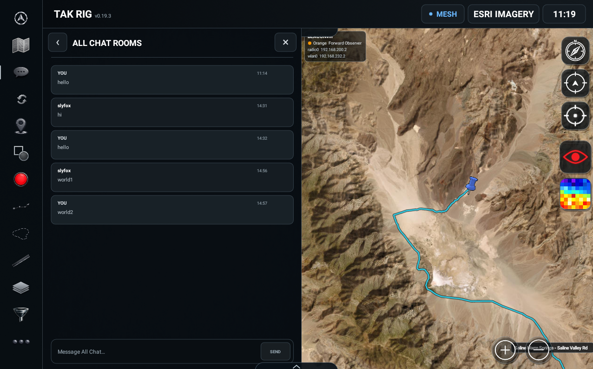</a> 
      <b>Chat Rooms</b>
    </td>
  </tr>
  <tr>
    <td align="center" width="50%">
      <a href="https://raw.githubusercontent.com/5lyf0x/TAK-Rig/main/screenshots/MARKER.png">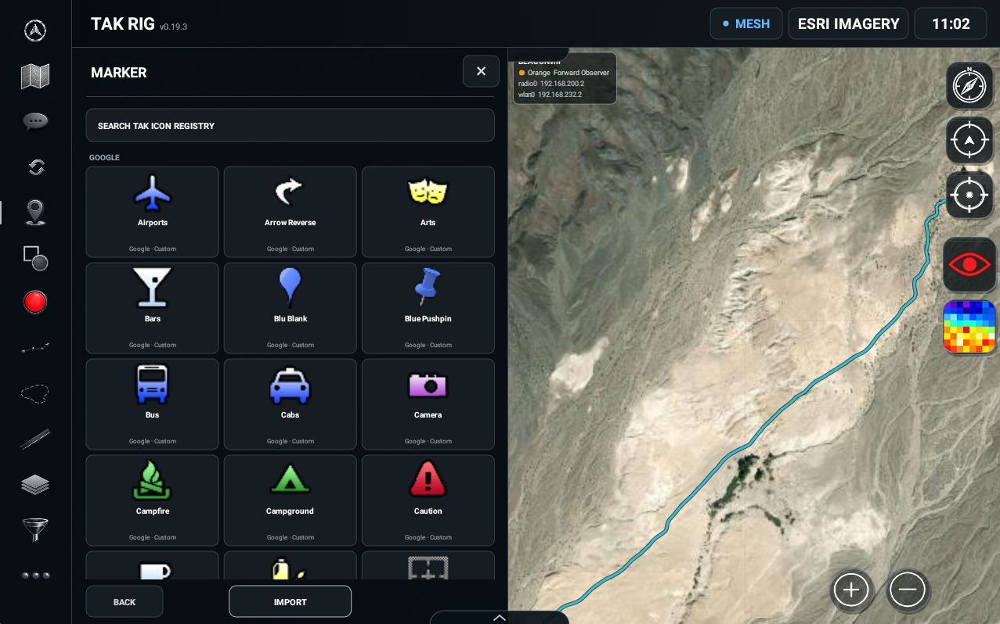</a> 
      <b>Marker Icon Registry</b>
    </td>
    <td align="center" width="50%">
      <a href="https://raw.githubusercontent.com/5lyf0x/TAK-Rig/main/screenshots/MEASURE.png">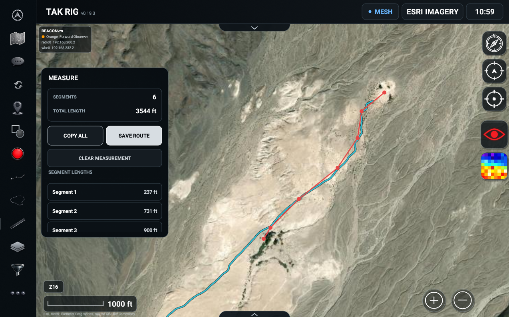</a> 
      <b>Measurement Tools</b>
    </td>
  </tr>
  <tr>
    <td align="center" width="50%">
      <a href="https://raw.githubusercontent.com/5lyf0x/TAK-Rig/main/screenshots/ELEVATION_HEATMAP.png">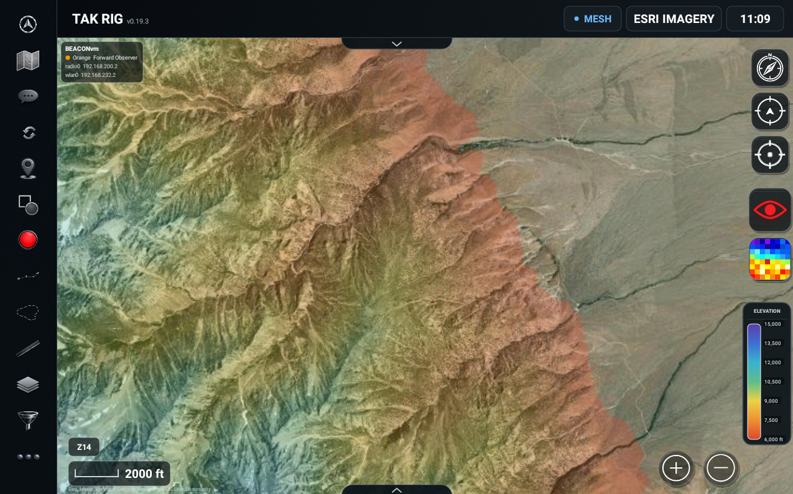</a> 
      <b>Elevation Heatmap</b>
    </td>
    <td align="center" width="50%">
      <a href="https://raw.githubusercontent.com/5lyf0x/TAK-Rig/main/screenshots/REDLIGHT.png">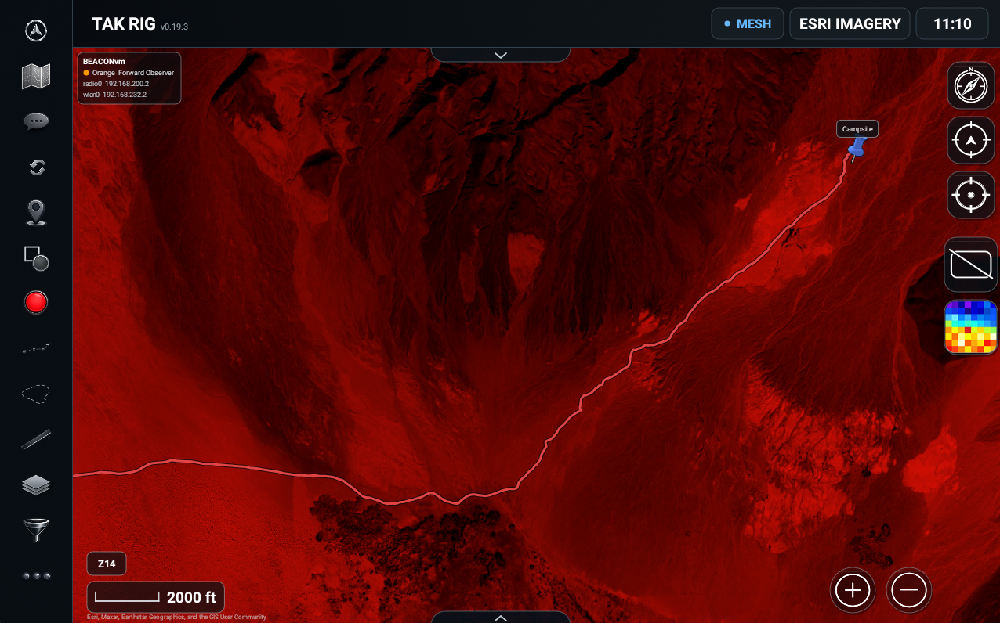</a> 
      <b>Red Light Map Mode</b>
    </td>
  </tr>
  <tr>
    <td align="center" width="50%">
      <a href="https://raw.githubusercontent.com/5lyf0x/TAK-Rig/main/screenshots/TOOLKIT_DRAWER.webp">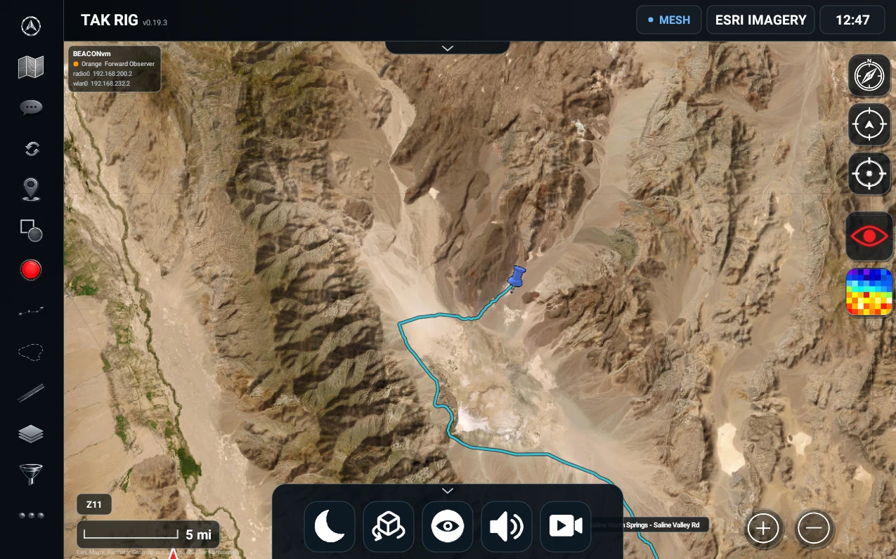</a> 
      <b>Toolkit Drawer</b>
    </td>
    <td align="center" width="50%">
      <a href="https://raw.githubusercontent.com/5lyf0x/TAK-Rig/main/screenshots/SUN-MOON.webp">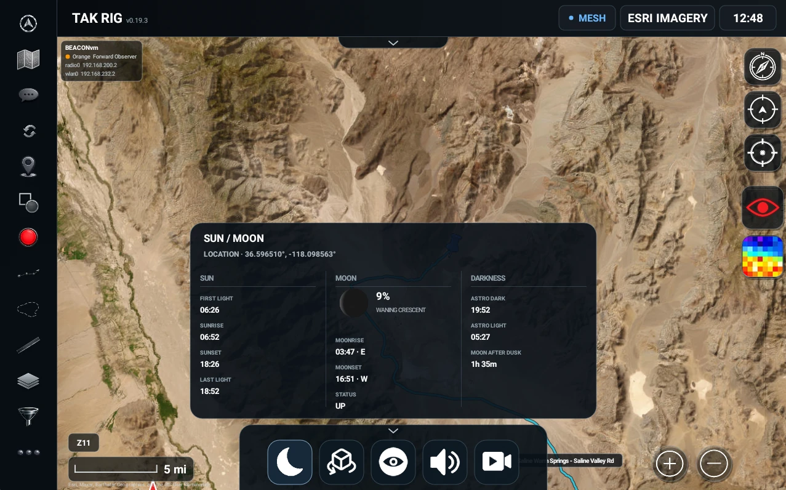</a> 
      <b>Sun / Moon</b>
    </td>
  </tr>
  <tr>
    <td align="center" width="50%">
      <a href="https://raw.githubusercontent.com/5lyf0x/TAK-Rig/main/screenshots/VIEWSHED_1.webp">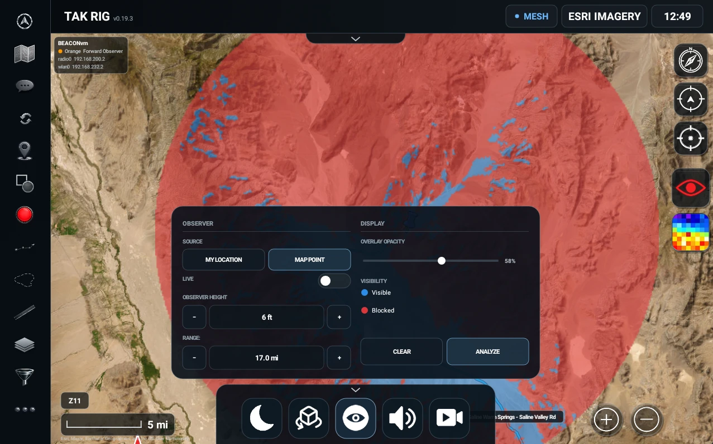</a> 
      <b>Viewshed Analysis</b>
    </td>
    <td align="center" width="50%">
      <a href="https://raw.githubusercontent.com/5lyf0x/TAK-Rig/main/screenshots/VIDEO_STREAMS.webp">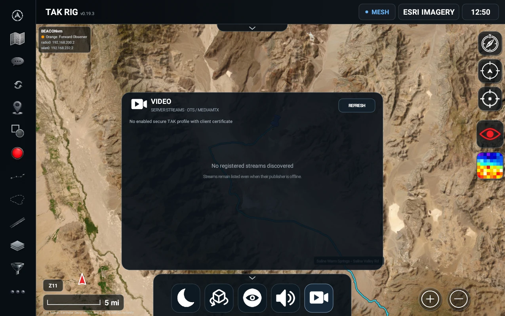</a> 
      <b>Video Streams</b>
    </td>
  </tr>
</table>
