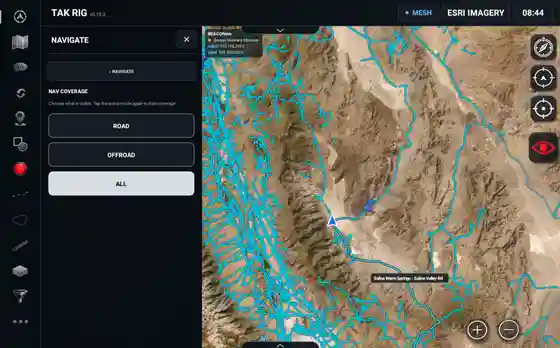
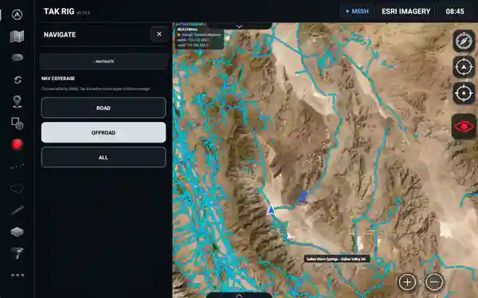
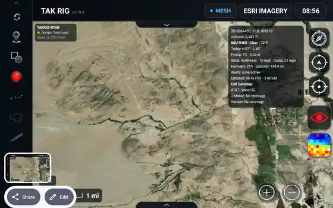
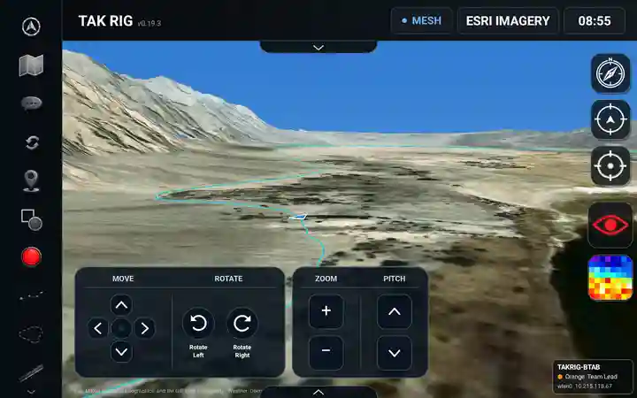
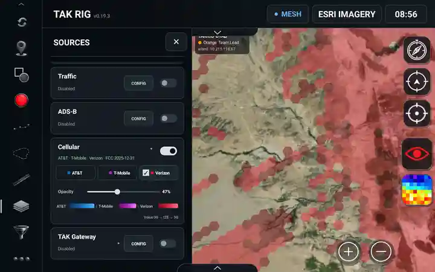

# TAK Rig Screenshots

A compact gallery of TAK Rig interface screenshots. Click any thumbnail to open the full-resolution image.

<table>
  <tr>
    <td align="center" width="16.66%">
       
      <b>ADS-B Aircraft Tracking</b>
    </td>
    <td align="center" width="16.66%">
       
      <b>Route Details &amp; Elevation Profile</b>
    </td>
    <td align="center" width="16.66%">
       
      <b>Basemap Selection</b>
    </td>
    <td align="center" width="16.66%">
       
      <b>Offline Map Download Setup</b>
    </td>
    <td align="center" width="16.66%">
       
      <b>Offline Map Download Progress</b>
    </td>
    <td align="center" width="16.66%">
       
      <b>Chat Rooms</b>
    </td>
  </tr>
  <tr>
    <td align="center" width="16.66%">
       
      <b>Marker Icon Registry</b>
    </td>
    <td align="center" width="16.66%">
       
      <b>Measurement Tools</b>
    </td>
    <td align="center" width="16.66%">
       
      <b>Elevation Heatmap</b>
    </td>
    <td align="center" width="16.66%">
       
      <b>Red Light Map Mode</b>
    </td>
    <td align="center" width="16.66%">
       
      <b>Toolkit Drawer</b>
    </td>
    <td align="center" width="16.66%">
       
      <b>Sun / Moon</b>
    </td>
  </tr>
  <tr>
    <td align="center" width="16.66%">
       
      <b>Viewshed Analysis</b>
    </td>
    <td align="center" width="16.66%">
       
      <b>Video Streams</b>
    </td>
    <td align="center" width="16.66%">
       
      <b>3D Terrain</b>
    </td>
    <td align="center" width="16.66%">
       
      <b>Navigate</b>
    </td>
    <td align="center" width="16.66%">
       
      <b>Road in Navigate</b>
    </td>
    <td align="center" width="16.66%">
       
      <b>Offroad in Navigate</b>
    </td>
  </tr>
  <tr>
    <td align="center" colspan="2">
       
      <b>Information Box</b>
    </td>
    <td align="center" colspan="2">
       
      <b>3D Terrain</b>
    </td>
    <td align="center" colspan="2">
       
      <b>Cell Coverage</b>
    </td>
  </tr>
</table>
